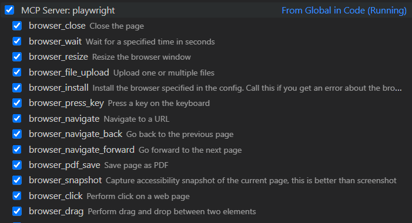

# MCP Project

## Overview

The MCP project is designed to provide a modular and extensible framework for managing and interacting with various servers and the Model Context Protocol. It aims to simplify server configuration and execution while integrating tools like Playwright and TypeScript. Right now this program only has the Playwright server.

## Features

- **Server Management**: Configure and execute servers using `npx` commands, such as Playwright MCP.
- **TypeScript Support**: Leverages TypeScript for type safety and modern JavaScript features.
- **Customizable Configuration**: Includes a `chatgpt_mcp_config.json` file for defining server commands and arguments.
- **Playwright Integration**: Supports Playwright MCP for browser automation and testing.
- **Live Server Settings**: Configured for live server usage to streamline development.
- **Code Formatting and Linting**: Prettier and ESLint are integrated for consistent code style and error checking.

## Installation

1. Clone the repository:

```bash
git clone https://github.com/camilomontenegro/MCP.git
```

2. Navigate to the project directory:
3. Install dependencies:

```bash
npm install @modelcontextprotocol/inspector (This is in case you just want to check if the connection works)
npm install @modelcontextprotocol/sdk
npm install tsx
npm install zod
```

## Usage

1. Run the application:
   To run this program on the MCP inspector try:

```bash
npx -y @modelcontextprotocol/inspector npx -y tsx main.ts
```

2. Usage with copilot.
   Run the server with:

```bash
npx tsx main.ts
```

Make sure your copilot is set to "Agent mode". When you run the server you´ll find that Copilot detects the tools you can use.

## Screenshots

### Copilot in Action


### Available Tools


